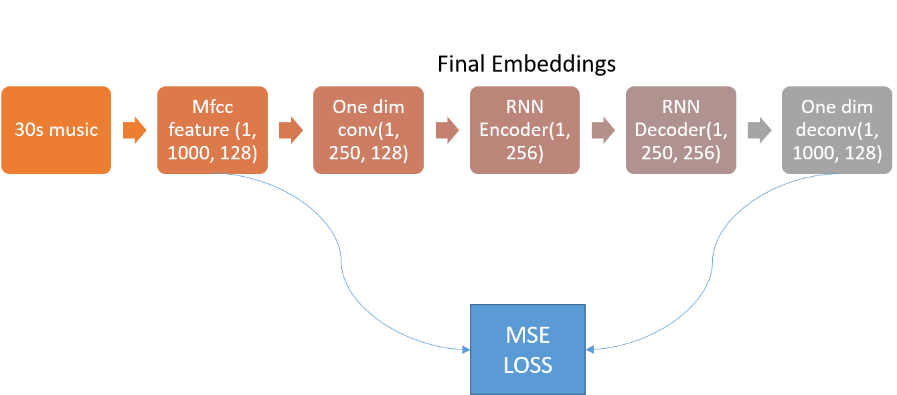
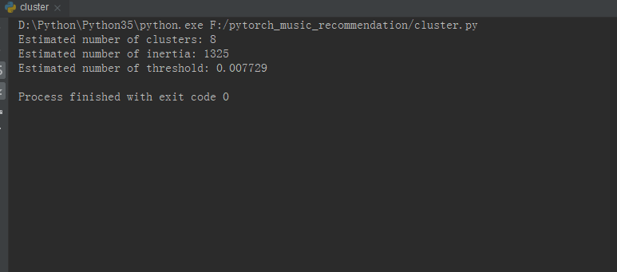
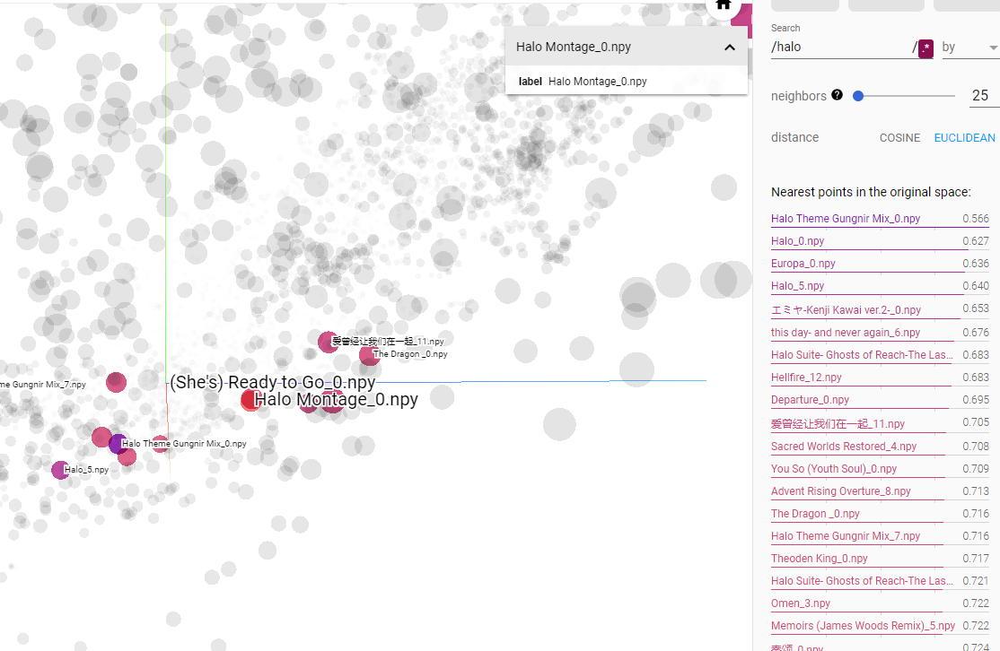

# Pytorch Music Recommendation System
personal experiment staff
## Motivation
Yet, there exsits many deep learning based music recommendation system, but they usually require supervised signal(favor list and unfavor list) or collaborative filtering, which is impractic for a normal user to apply. 
For an ordinary user, it's most likely that you only have a favor list of songs and a lot of songs you don't know you like or not. Based on above situation, this approach is designed.
## Method
### Music2Vector
The first step is to use unsupervised approaches to vectornize each music into a embedding space. The major idea is similar to Doc2Vec approach. Masked [LM(MLM)](https://arxiv.org/abs/1810.04805) was adopted for training. For details please see the below image and codes.

### Clustering
You now have a embedding space for music! Still it's not enough to build a recommendation system. In this step, clustering algorithm is adopted to find the cluster centers of your favor songs. Then use those centers and set a threshold, you can now guess if a new song satisfies you according to the minimum distance between one of those centers.

## Does it work?
I do not perform a quantitative research on it. But usually for a 30s music segment, its' cloest neighbors are other segments from the same song or sgements from a different version of that song. The below images shows the projector results of my embedding space.

## How to use it
create 5 directories under the branch: favor_data, favorite, general_data, togather, save256. Put your favorite songs in favorite in wav form, then put general songs(including your favorite ones) in togather.  
run data_prepare.py to generate data 
run train.py to train the model 
run data_emb.py to generate the embeddings 
run cluster.py to estimate the cluster centers and threshold 
run eval.py  _path_of_wav_file_  _threshold_  to test if a new song will be accepted
